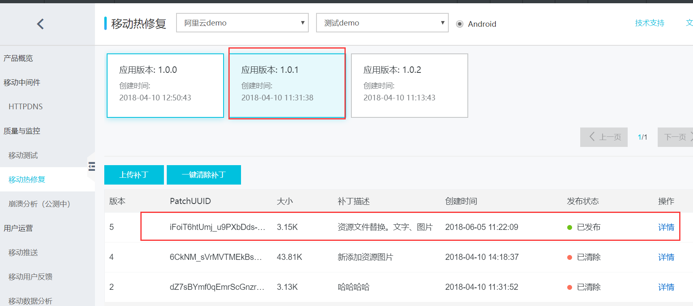
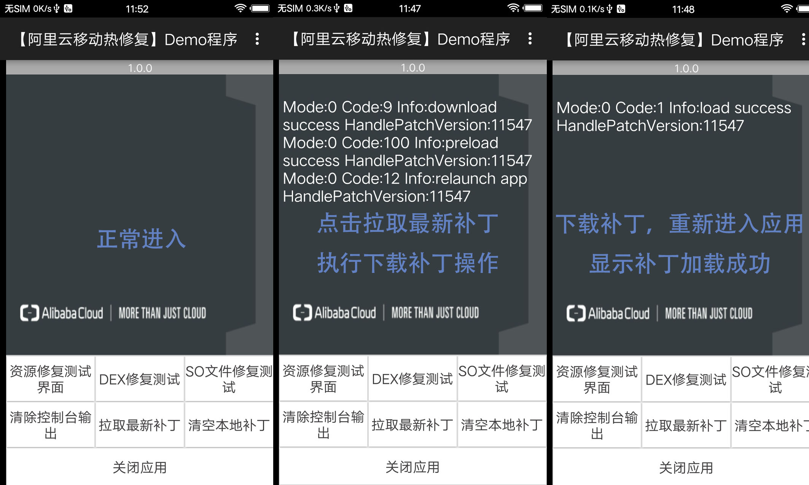
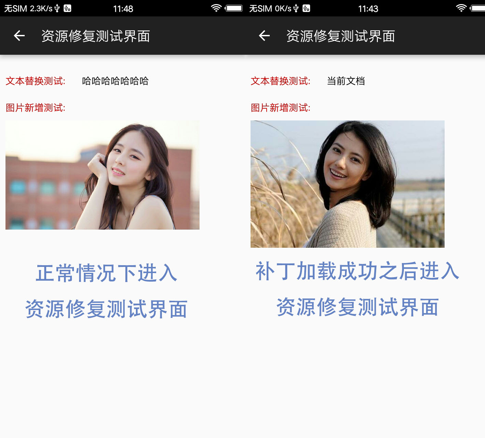
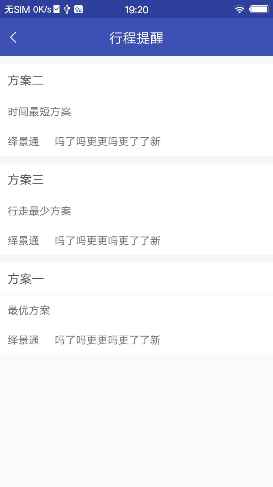
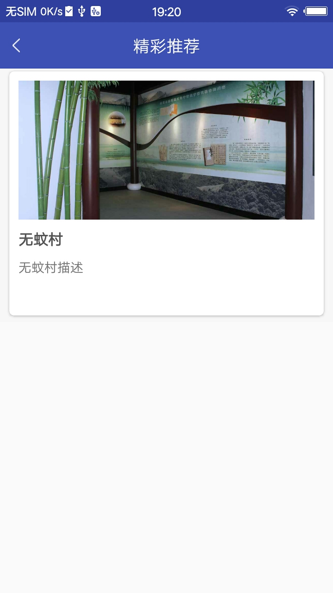
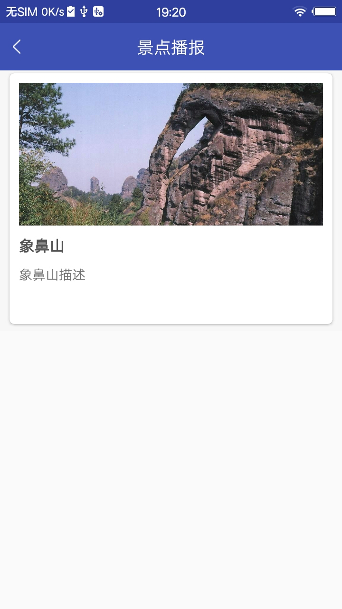
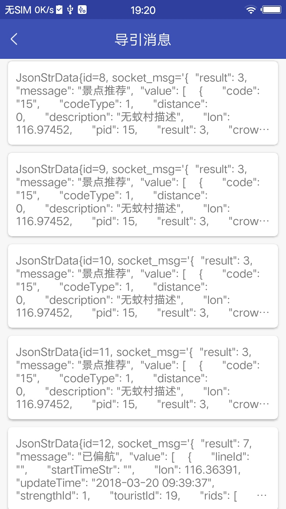
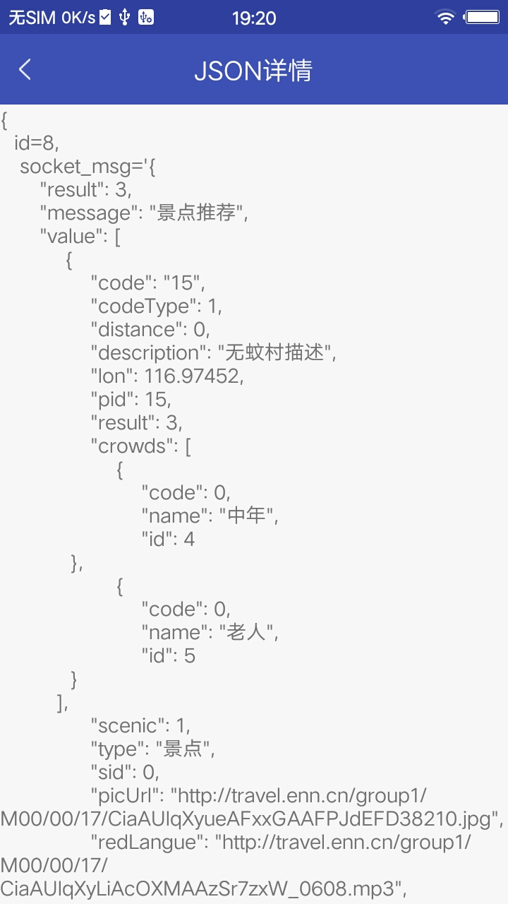
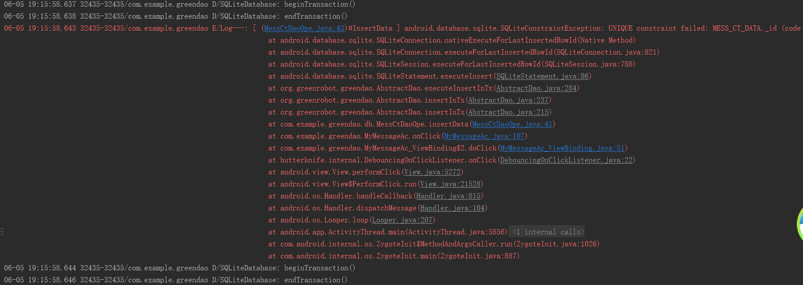

# MyApplication
app：Rxjava+Lambda(java8)+Lombok。hotfix_android_demo：阿里云热修复测试

## 效果图如下

### RxJava效果
>

### Lambda表达式效果图
>

### 阿里云热修复效果图

<div align="center">
  <h4 align="center">在阿里巴巴后台的界面</h4>
  
  <h4 align="center">在APP首页显示日志效果图</h4>
  
  <h4 align="center">热修复功能在资源测试界面的体现</h4>
  
 </div>

### GreenDao效果图

>#### 下面是数据库GreenDao的操作界面
<div align="center">
<p align="center">在首页和我的消息界面可以操作数据库，点击更多案例可以进入我的消息界面</p>


</div>

<div align="center">
<p align="center">点击“新增偏航数据”按钮后，进入行程提醒界面可看到新增的数据。<br>再次点击“新增偏航数据”按钮后，新城提醒界面数据更新可进入查看</p>
<p align="center">执行的方法为：insertOrReplaceData，如果新增数据id已经存在就会覆盖之前的数据。</p>
 
</div>

<div align="center">
<p align="center" width="300">点击“新增推荐数据”按钮后，进入精彩推荐和景点播报界面可看到新增的数据。<br>再次点击“新增推荐数据”按钮后，数据不更新内部方法已经报错。</p>
<p align="center">执行的方法为：insertData，如果新增数据id已经存在则会报错。</p>
 

</div>

<div align="center">
<p align="center" width="300">点击“新增推荐数据”或者“新增推荐数据”按钮后，都会将json数据保存到数据库。<br>可以进入导引消息界面查看。</p>
<p align="center">执行的方法为：insertData，新增数据id会按序增加。</p>
 

</div>

```
@Entity
public class JsonStrData {
    @Id(autoincrement = true)
    private Long id;
}
JsonStrDaoOpe.insertData(mContext, new JsonStrData(null, getLocalStr("WuWCData.json")));
```

#### 使用insertData方法，如果数据库存在对应的id值会报下面的错。使用insertOrReplaceData方法则会将id相同的数据进行更新


